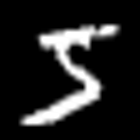
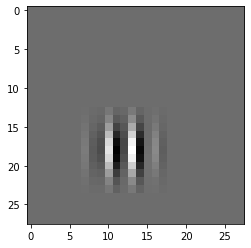

# Catastrophic Forgetting

## Introduction

The phenomenon of catastrophic forgetting, or catastrophic interference, was first observed by McCloskey and Cohen (1989). It is especially salient in online learning, where training data is fed sequentially to a machine learning model for training. In this notebook, we will explore the effects of catastrophic interference in the PES learning rule on MNIST data.


```python
import nengo
import nengo_dl
import numpy as np
import tensorflow as tf
from PIL import Image
from nengo_extras.gui import image_display_function
from nengo_extras.vision import Gabor, Mask
from nengo_extras.data import one_hot_from_labels
from nengo.utils.filter_design import cont2discrete
from nengo_gui.ipython import IPythonViz

```

## MNIST Digit Recognition

We will experiment on catastrophic interference with MNIST.


```python
(X_train, y_train), (X_test, y_test) = tf.keras.datasets.mnist.load_data()
n_train, height, width = X_train.shape
n_test = len(y_test)
n_classes = len(np.unique(y_train))
```


```python
Image.fromarray(X_train[0]) \
    .resize((height * 5, width * 5)) \
    .show()

print(f"Label: {y_train[0]}")
print(f"Max Pixel Val: {np.max(X_train[0])}")
print(f"Min Pixel Val: {np.min(X_train[0])}")
```


    

    


    Label: 5
    Max Pixel Val: 255
    Min Pixel Val: 0


```python
# Batch preprocess the data into unit vector.
def preprocess(X):
    X = X.reshape(len(X), -1)
    X = X - X.mean(axis=1, keepdims=True)
    return X / np.linalg.norm(X, axis=1, keepdims=True)
```


```python
# Preprocessing and One hot encode
X_train = preprocess(X_train)
y_train = one_hot_from_labels(y_train)
X_test = preprocess(X_test)
y_test = one_hot_from_labels(y_test)
```

## Neural Network

We build a 2 ensemble neural network with Nengo, and set the learning with PES learning rule.


```python
# Some network configuration hyperparameters
input_display_time = 1
n_neurons = 5000
```

Neural networks in Nengo are fixed-encoding networks, whereby the encoders are fixed to a certain randomly generated value. Previous research has shown that Gabor filters best extracts the features of an image. Unlike in deep learning, where these Gabor filters are derived from backpropagation, we can only generate these Gabor filters randomly because backpropagation cannot be used in fixed-encoding SNN.


```python
# Generate the encoders for the neural ensemble
gabor_size = (11, 11)
# Set the rng state (using a fixed seed that works)
rng = np.random.RandomState(9)
encoders = Gabor().generate(n_neurons, gabor_size, rng=rng)
encoders = Mask((height, width)).populate(encoders, rng=rng, flatten=True)
```


```python
from matplotlib import pyplot as plt
plt.imshow(encoders[1].reshape(28,28), cmap="gray")
```


    <matplotlib.image.AxesImage at 0x7faca21b40a0>


    

    


Below is the nengo model rendered as an interactive demo in Nengo GUI. You can see the effects of catastrophic forgetting when you inhibit the learning by moving the slider of inhibitor to 1 (Wait for 30s for the simulation to run and learn)


```python
with nengo.Network(seed=3) as model:

    input_node = nengo.Node(
        nengo.processes.PresentInput(X_train, input_display_time),
        label="Input"
    )

    # Pre-synaptic ensemble
    pre_ens = nengo.Ensemble(
        n_neurons=n_neurons,
        dimensions=height * width,
        radius=1
    )
    
    nengo.Connection(input_node, pre_ens)
    
    post_ens = nengo.Ensemble(
        n_neurons=30*n_classes,
        dimensions=n_classes,
        radius=5
    )
    
    # Connection with synapse weight to be learned by PES
    # Weights are randomly initialized
    conn = nengo.Connection(
        pre_ens, post_ens,
        learning_rule_type=nengo.PES(),
        transform=np.random.rand(n_classes, width*height)
    )
    
    # Error signal representation
    error = nengo.Ensemble(
        n_neurons=30 * n_classes,
        dimensions=n_classes,
        radius=5
    )
    
    gt_node = nengo.Node(
        nengo.processes.PresentInput(y_train, input_display_time),
        label="Ground Truth"
    )
    nengo.Connection(post_ens, error)
    nengo.Connection(gt_node, error, transform=-1)
    nengo.Connection(error, conn.learning_rule)
    
    # Input image display (for nengo_gui)
    image_shape = (1, 28, 28)
    display_func = image_display_function(image_shape, offset=1, scale=128)
    display_node = nengo.Node(display_func, size_in=input_node.size_out)
    nengo.Connection(input_node, display_node, synapse=None)
    
    # Error inhibition control
    inhibitor = nengo.Node([0])
    nengo.Connection(
        inhibitor, error.neurons, 
        transform=-100*np.ones((error.n_neurons, 1))
    )
    

# Network visualization
IPythonViz(model)
```


<script type="text/javascript" id="2b4e9dd6-1b14-4cd2-8faf-2300bca115ea">
{
    let req = new XMLHttpRequest();
    req.addEventListener("load", function() {
        if (this.status != 200 && this.response != 'OK') {
            let p = document.getElementById('2b4e9dd6-1b14-4cd2-8faf-2300bca115ea').parentNode;
            p.innerHTML +=
                'The nengo_gui.jupyter notebook server ' +
                'extension was not loaded. Please activate it ' +
                'with the following command:' +
                '<pre>jupyter serverextension enable ' +
                'nengo_gui.jupyter</pre>';
            p.classList.add('output_stderr');
        }
    });
    req.open('GET', './nengo/check', true);
    req.send();
}
</script>


<div id="f8e4845e-e468-4a99-848b-72fada7892eb">
    <iframe
        src="./nengo/32841/?token=e7042c5505bbfd5b22f901db76c0d4918b0039b4d943aecf"
        width="100%"
        height="600"
        frameborder="0"
        class="cell"
        style="border: 1px solid #eee; box-sizing: border-box;"
        allowfullscreen></iframe>
</div>


You should see that once inhibitor is turned on, the neural network stops learning and just predicts everything as the predicted label of the last seen sample. This means that the last seen sample before inhibition has turned on has caused catastrophic forgetting in the synapse weights between pre-synaptic and post-synaptic neuron ensemble. This needs to be mitigated.

## Legendre Memory Units

LMUs is a type of recurrent neural network cell that aims to implement a perfect delay. It was first published by Volker, Kajic and Eliasmith (NeurIPs 2019) and has been shown to beat LSTMs on psMNIST dataset.


```python
class LMUCell(nengo.Network):
    """ Legendre Memory Unit """
    
    def __init__(self, units, order, theta, input_d, **kwargs):
        """ Constructor for LMU
        
        :param units:
        :param order: The order of Lengendre Polynomials to use.
        :param theta: Delay amount defining the sliding window from [t-theta, t]. 
                Can also be interpreted as length of time window.
        :param input_d: Dimension of input signal X
        """
        super().__init__(**kwargs)
        
        # Compute the analytically derived weight matrices used in LMU
        # These are determined statistically based on the theta/order parameters.
        Q = np.arange(order, dtype=np.float64)
        R = (2 * Q + 1)[:, None] / theta
        j, i = np.mesgrid(Q, Q)
        
        A = np.where(i < j, -1, (-1, 0) ** (i - j + 1) * R)
        B = (-1.0) ** Q[:, None] * R
        C = np.ones((1, order))
        D = np.zeros((1,))
        
        A, B, _, _, _ = cont2discrete((A, B, C, D), dt=1.0, method="zoh")
        
        with self:
            nengo_dl.configure_settings(trainable=None)
            
            # Create objects corresponding to x/u/m/h variables of LMU cell
            # There is a bit of notational change compared to X and U in NEF
            # self.u is the input as seen by the dynamical system, self.m is the state from previous time,
            # self.x is our actual data input.
            self.x = nengo.Node(size_in=input_d)
            self.u = nengo.Node(size_in=1)
            self.m = nengo.Node(size_in=order)
            self.h = nengo_dl.TensorNode(tf.nn.tanh, shape_in(units,), pass_time=False)
            
            # Compute u_t in the LMU cell. We have removed e_h and e_m as they are not needed in
            # the psMNIST task. e_x is trainable, but initialized to np.ones instead of nengo_dl.dists.Glorot()
            nengo.Connection(
                self.x, self.u, transform=np.ones((1, input_d), synapse=None)
            )
            
            # Compute m_t
            # In this implementation we'll make A and B non-trainable, but they
            # can also be optimized in the same way as other parameters. Note
            # that setting synapse=0 (versus synapse=None) adds a one-timestep
            # delay, so we can think of any connections with synapse=0 as representing
            # value_{t-1}
            conn_A = nengo.Connection(self.m, self.m, transform=A, synapse=0)
            self.config[conn_A].trainable = False
            conn_B = nengo.Connection(self.u, self.m, transform=B, synapse=None)
            self.config[conn_B].trainable = False
            
            # Compute h_t
            nengo.Connection(
                # This is the W_x connection
                self.x, self.h, transform=nengo_dl.dists.Glorot(), synapse=None
            )
            nengo.Connection(
                # This is the W_h connection
                self.h, self.h, transform=nengo_dl.dists.Glorot(), synapse=0
            )
            nengo.Connection(
                # This is the W_m connection
                self.m, self.h, transform=nengo_dl.dists.Glorot(), synapse=None
            )
            
```

In the above code, conn_A and conn_B 
